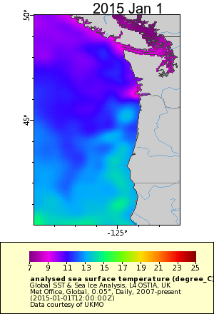

```{r m-setup, include=FALSE}
knitr::opts_chunk$set(echo = TRUE, eval = FALSE)
```


## Creating gifs

Load the packages.  
```{r m-packages}
library(ggplot2) # plotting
library(dplyr) # for %>% pipe
library(purrr) # for map()
library(magick) # for image_* functions
library(stringr) # for the header on images
```

### Step 1. Install ImageMagick

Here is how to do it on a Mac (MacOS Sierra 10.12.6); Google to figure this out for Windows or Unix.

1. Open up utilities (in apps), and open Terminal.  
2. Type the following on the command line to install `brew`
```
ruby -e "$(curl -fsSL https://raw.github.com/mxcl/homebrew/go/install)"
```
3. Then you can install ImageMagick with this command.
```
brew install imagemagick
```

### Step 2. Dir locaton

```{r dir}
year <- 2015
fil_dir <- paste0("pngs/sst_", year)
```

  
### Step 3. Make the gif

```{r make_gif}
gif_fil <- paste0("pnw_sst_", year, ".gif")
list.files(path = fil_dir, pattern = "*.png", full.names = TRUE) %>%
  purrr::map(magick::image_read) %>% # reads each path file
  magick::image_join() %>% # joins image
  magick::image_animate(fps = 4, loop = 1) %>% # animates, can opt for number of loops
  magick::image_write(gif_fil) # write to current dir
```

### Finished Product

This shows SST off the WA-OR coast in 2015.

<div style="text-align:center" markdown="1">




</div>


### Make a mp4


